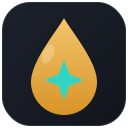
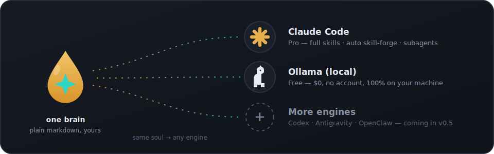

<div align="center">

<picture>
  <source media="(prefers-color-scheme: dark)" srcset="assets/logo-dark.svg">
  <source media="(prefers-color-scheme: light)" srcset="assets/logo-light.svg">
  
</picture>

# SoulDrop

**把一个灵魂放进任何一台机器 — 你的个人 AI 助手，全自动。**
<br>
<sub><i>Drop a soul into any machine — your personal AI assistant, fully automatic.</i></sub>

<br>
<br>

[](https://github.com/supakitkitsathaporn97-collab/souldrop/actions/workflows/validate.yml)
[](CHANGELOG.md)
[](LICENSE)


[](https://github.com/supakitkitsathaporn97-collab/souldrop/pulls)

<br>

[English](README.md) · [Tiếng Việt](README.vi.md) · [ไทย](README.th.md) · [한국어](README.ko.md) · **中文**

<br>



</div>

一条命令。一场友好的访谈(绝无技术问题)。你将得到一个有自己名字、性格、长期记忆和"第二大脑"的助手 — 运行在适合你的引擎上，**付费或 100% 免费**。

> 英语和越南语是主要支持语言。泰语、韩语、中文获完整支持；其他语言可通过"其他"选项使用。

---

## 🚀 安装 — 一条命令

**Windows** — 打开 **PowerShell**(按开始键，输入"PowerShell"，回车)，粘贴:

```powershell
irm https://raw.githubusercontent.com/supakitkitsathaporn97-collab/souldrop/main/install/go.ps1 | iex
```

**macOS / Linux** — 打开**终端**，粘贴:

```bash
curl -fsSL https://raw.githubusercontent.com/supakitkitsathaporn97-collab/souldrop/main/install/go.sh | bash
```

### 然后

**Pro 引擎 (Claude):**
1. 输入 `claude` 回车，浏览器打开后登录(需要付费订阅)。
2. 输入 `/onboard`，选择语言，认识你的新助手 — 它甚至会在打招呼前为你的职业锻造 3–5 个专属技能。

**免费引擎 (本地):**
1. 双击桌面上的 **SoulDrop**(Windows)，或在新终端输入 `souldrop`。
2. 回答六个友好的问题(你的名字、工作、目标、助手的名字...) — 完成。一切都在你的机器上运行，什么都不会外传。

## 🧠 选择你的引擎

<p align="center">
  
</p>

SoulDrop 把**大脑**(你的助手是谁 — 属于你的纯 markdown 文件)与**引擎**(运行它的东西)分开。同一个灵魂，任何引擎:

| 引擎 | 费用 | 你得到什么 |
|---|---|---|
| **Pro — [Claude Code](https://code.claude.com)** | 付费 Claude 订阅 (Pro/Max) | 最聪明的档位: 完整技能、**自动锻造技能**(为你的职业自动生成专属能力)、子代理 |
| **免费 — [Ollama](https://ollama.com) (本地)** | **0 元，无需账号** | 100% 在你自己电脑上运行的真助手: 人设、记忆、"记住..."、第二大脑。默认私密 |
| Codex · Antigravity · OpenClaw | — | 🔜 v0.5 推出 |

你不需要做任何技术选择 — 安装程序会**自动检测 Claude Code**，否则只问一个问题: *免费还是 Pro?*

## 📦 要求

- Windows 10 1809+ / macOS 13+ / Ubuntu 20.04+，安装时需联网
- **免费引擎:** 无其他要求。AI 模型约占 2–5 GB 磁盘(自动按内存大小挑选)
- **Pro 引擎:** 付费 Claude 订阅 (Pro、Max 或 Team) — [claude.ai](https://claude.ai)
- **还没有 Claude?** 从 7 天免费 Pro 试用开始 → [claude.ai/referral/QbA1I722cA](https://claude.ai/referral/QbA1I722cA) *(推荐链接 — 支持本项目)*

## 🔁 一个大脑，多个引擎

大脑是**纯 markdown — 引擎可互换**: 一个人设文件(助手是谁)、一个记忆库(随时说*"记住..."*即可保存)、以及所有引擎共享的 `~/second-brain` 笔记库。每个文件你都可以自己阅读、编辑、备份或搬到新机器。规范: [`brain/`](brain/README.md) · 新引擎的适配器契约: [`adapters/`](adapters/README.md)。

## 🧩 Pro 插件内含什么

| 技能 | 作用 |
|---|---|
| `/onboard` | 创建个性化助手 + 记忆 + 专属技能 + 第二大脑的访谈 — 支持英语、越南语、泰语、韩语、中文或你自己的语言 |
| `forge-skills` | **为你的职业和目标自动构建 3–5 个专属技能** — 在 `/onboard` 结束时自动运行，可随时重跑 |
| `create-skill` | 描述一个新能力，助手自己编写并安装该技能(与锻造同一质量门槛) |
| `remember` | 把事实/偏好存入助手的长期记忆 |
| `recall` | 找回你以前告诉它的事 |
| `learn-from-mistakes` | 把你的纠正变成永久规则 |
| `daily-note` | 简单的每日日记 |
| `work-smart` | 让助手先规划再行动，避免浪费步骤 |
| `personal` | 个人助理基线: 一致的人设、记忆习惯、诚实、安全边界 |
| `leader` | 面向大任务: 规划、拆解、委派、验证、汇报一个干净的答案 |
| `/setup-vault` | (重新)创建 `~/second-brain` 第二大脑笔记库 — 兼容 Obsidian |
| `obsidian-markdown` · `obsidian-cli` | 正确书写和整理笔记(双链、标签、安全文件操作) |

## 🆓 免费引擎给你什么

`souldrop` 聊天启动器(桌面快捷方式 / 终端命令): 加载助手的灵魂，从按你电脑配置挑选的本地模型流式回复(内存 16 GB+ → 8B 模型，8–16 GB → 3B，低于 8 GB → 1B 并诚实注明"较基础")，你说*"记住..."*时保存事实，并写入与 Pro 档相同的第二大脑。此档位没有技能锻造 — 小型本地模型编写技能不够可靠，因此 SoulDrop 核心技能的内容被直接折叠进人设。随时重跑安装程序即可升级到 Pro；你的大脑会跟着走。

## 📔 你的第二大脑

初始化会在 `~/second-brain` 创建笔记库 — 助手读写的纯 markdown 文件(每日笔记、项目、人物、想法)。用免费的 [Obsidian](https://obsidian.md) 应用打开该文件夹("Open folder as vault")即可可视化浏览 — Pro 安装程序甚至会尝试帮你安装 Obsidian，装不上一切也照常以纯文件工作。Pro 安装程序还会尝试可选的"智能记忆"升级(开源 [agentmemory](https://github.com/rohitg00/agentmemory) 插件)；如果不行，助手依然通过文件记住一切。

## ❓ 常见问题

**这是 Anthropic 或 Ollama 的官方软件吗?**
不是。SoulDrop 是独立的入门套件。它只通过 Claude Code 和 Ollama 各自的官方安装程序安装它们，然后在其上添加 SoulDrop 大脑。见 [NOTICE](NOTICE)。

**免费版真的免费吗?**
真的。本地引擎(Ollama)和模型都是开源的，完全在你的电脑上运行。没有账号、没有订阅、没有隐藏费用 — 只占用磁盘空间和你自己的硬件。

**安装脚本安全吗?**
安全 — 而且你不必凭空相信我们: 自己阅读 [`install/go.ps1`](install/go.ps1) 和 [`install/go.sh`](install/go.sh)。它们只调用官方安装程序、把本仓库注册为插件市场、安装启动器。Windows SmartScreen 或杀毒软件可能对任何来自互联网的脚本发出警告 — 对这种安装方式来说很正常。

**不小心运行了两次。**
完全没问题 — 脚本可以安全重跑，已安装的部分会自动跳过。

**以后能更换助手吗?**
能。随时重跑 `/onboard`(Pro)或 `souldrop -Reset` / `souldrop --reset`(免费)。旧档案总是先备份，绝不删除。

**它收集我的数据吗?**
不。一切都留在你自己的机器上 — Pro 在 `~/.claude/`，免费版在 `~/souldrop-brain/`。免费档位连 AI 都不会离开你的电脑。

**旧链接写着 `claude-easy-install`?**
同一个项目 — SoulDrop 是 v0.4.0 起的新名字。旧 GitHub 链接会自动重定向。

## 📄 许可证

MIT — 见 [LICENSE](LICENSE)。Claude Code 属于 Anthropic，Ollama 属于 Ollama，均通过各自官方安装程序安装；见 [NOTICE](NOTICE)。

---

<div align="center">


**SoulDrop** — 一个大脑，任何引擎。

<sub>MIT © SK Production · <a href="LICENSE">LICENSE</a> · <a href="NOTICE">NOTICE</a></sub>

</div>
